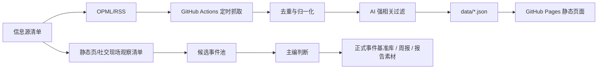

<div align="center">

# AI时代文明观察日报

## 记录AI，理解人类｜观察技术，守住存在

**一个不需要服务器、由 GitHub Actions 自动更新的 AI 文明变化观察站。**

[](https://tianhongcctv.github.io/ai-news-radar/)
[](https://github.com/tianhongcctv/ai-news-radar/actions/workflows/update-news.yml)
[](LICENSE)

[在线页面](https://tianhongcctv.github.io/ai-news-radar/) · [部署说明](DEPLOY_AI_CIVILIZATION_OBSERVATORY.md) · [静态源观察清单](docs/static-watchlist.md) · [伯乐Skill](skills/ai-news-radar/README.md)

</div>

---

## 这是什么

**AI时代文明观察日报** 是《AI时代文明观察》项目的自动化信息入口。

它不是普通的 AI 快讯，也不是模型参数追踪器。它关注的是：

> AI 如何改变人类知识结构、社会关系、文明形态与存在方式。

这个站点基于 `LearnPrompt/ai-news-radar` 改造，继承了伯乐Skill的核心思路：先判断信源，再接入；先过滤噪声，再形成每日观察入口。

每天，GitHub Actions 会自动抓取公开 RSS / OPML / feed 信息源，生成静态 JSON 数据，并由 GitHub Pages 展示出来。整个流程不需要服务器，不需要数据库，默认不需要任何 API Key。

## 项目定位

《AI时代文明观察》的核心问题不是“AI 又发布了什么”，而是：

- AI 是否改变了知识的生产、组织、传播和调用方式？
- 普通人是否借助 AI 获得了过去只有团队才能完成的能力？
- 教师、记者、医生、律师、程序员等知识职业是否正在被重组？
- 组织是否因为 AI 变得更轻、更小、更自动化？
- 教育、版权、监管、劳动与责任制度是否被迫调整？
- AI 是否进入陪伴、情感、孤独、死亡、意义等存在层领域？
- 当世界越来越可编码、可计算、可调度，人类不可替代的边界在哪里？

## 当前能力

- 自动抓取最近 24 小时 AI 相关信息
- 支持 GitHub Actions 定时更新
- 支持 GitHub Pages 静态部署
- 支持私有 OPML/RSS 订阅源，通过 `FOLLOW_OPML_B64` Secret 接入
- 支持 `RSS_MAX_FEEDS` 调整订阅源读取数量
- 支持 AI 强相关视图和全量视图
- 支持来源健康状态、站点筛选、搜索与分组展示
- 保留 `docs/static-watchlist.md` 作为非 RSS / 静态页 / 社交现场候选观察清单

## 信息源策略

本项目的信息源分为两层：

第一层是自动抓取层，主要使用 RSS / Atom / JSON feed，适合 GitHub Actions 稳定运行。

第二层是候选观察层，主要包括中文科技媒体、公众号、社交现场、政策监管页、法院文书、专题数据库等。这些来源不一定适合直接自动抓取，但非常适合进入候选事件池，由主编判断是否正式入库。

详见：

- [`docs/static-watchlist.md`](docs/static-watchlist.md)
- [`DEPLOY_AI_CIVILIZATION_OBSERVATORY.md`](DEPLOY_AI_CIVILIZATION_OBSERVATORY.md)

## 工作流



## GitHub 自动更新

`.github/workflows/update-news.yml` 已经配置好定时任务。

- 默认每 30 分钟运行一次
- 自动生成并提交 `data/*.json`
- 如果设置了 `FOLLOW_OPML_B64`，会自动解码为私有 `feeds/follow.opml`
- 如果没有设置 `FOLLOW_OPML_B64`，会使用公开示例 `feeds/follow.example.opml`
- 可通过仓库变量 `RSS_MAX_FEEDS` 调整 OPML feed 读取数量
- 默认不启用 X API、AgentMail 或其他需要密钥的高级源

## 本地运行

```bash
git clone https://github.com/tianhongcctv/ai-news-radar.git
cd ai-news-radar
python3 -m venv .venv
source .venv/bin/activate
pip install -r requirements.txt
python scripts/update_news.py --output-dir data --window-hours 24
python -m http.server 8080
```

打开：

```text
http://localhost:8080
```

如果你有本地 OPML：

```bash
python scripts/update_news.py --output-dir data --window-hours 24 --rss-opml feeds/follow.opml
```

注意：不要把私有 `feeds/follow.opml`、API Key、cookies、token 或邮箱正文提交到公开仓库。

## 项目口号

**记录AI，理解人类。**

**观察技术，守住存在。**

**不追热点，追问文明。**

---

## 上游项目

本项目基于 [LearnPrompt/ai-news-radar](https://github.com/LearnPrompt/ai-news-radar) fork 改造。

原项目提供了 AI News Radar、伯乐Skill、GitHub Actions 自动更新和 GitHub Pages 静态展示能力。

## License

[MIT](LICENSE)
